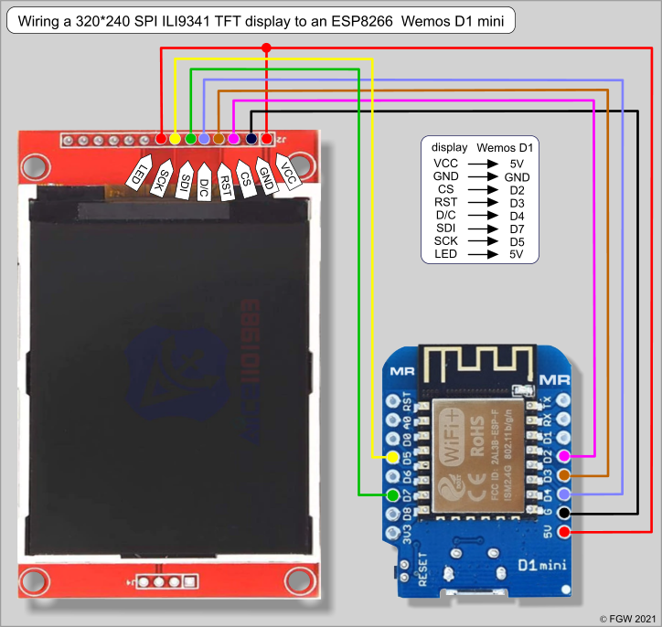

# RunMachine

## Setup:

-   Using esp now to connect with main body.
-   Using TFT screen 2.8 inch (240x320) and show logo when startup
-   Main body using ESP8266 12F, tracker using ESP8266 12F
-   Using HC595 in main body to show 6 LED
 
## TFT

-   Show an image 240x240 take 16.3s for 20 times.
-   Using converter in image_converter to convert .h file

-   Install python 3 and install PIL library by `pip install pillow`
-   Move to `image_convert` directory by `cd image_convert`

```
python converter.py
```


